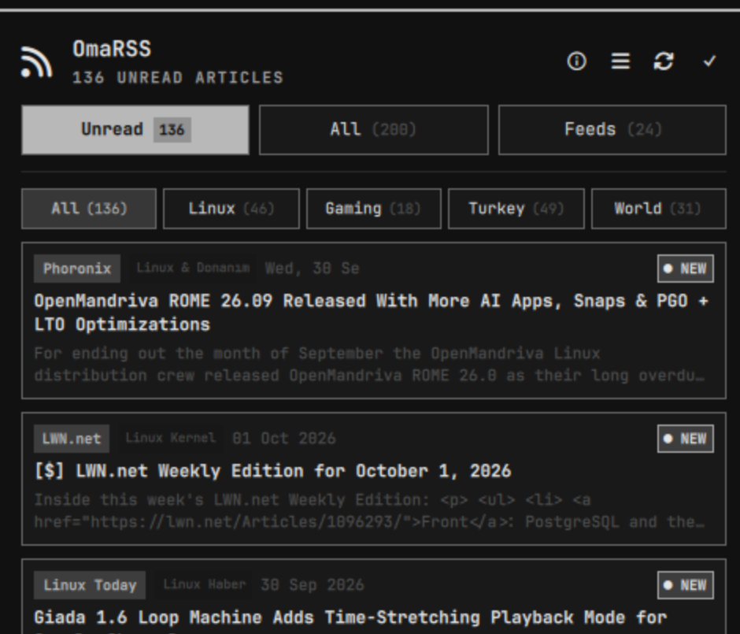

# OmaRSS - Native RSS and Atom Feed Hub for Omarchy Linux

[](https://github.com/ozdil)

[](https://buymeacoffee.com/ozdil)



Lightweight RSS and Atom feed reader and desktop notification hub for Omarchy Linux written in Rust.

Author: Ozan Ozdil (ozdil)  
License: MIT  
Plugin ID: ozdil.omarss

---

## Features

- Native Rust Engine (`omarss-engine`): Bounded process execution with POSIX timeouts, monotonic deadlines, and strict memory limits.
- Universal Feed Parser: Parses RSS 2.0 and Atom feeds with HTML entity decoding and tag stripping.
- Dynamic Status Indication: Top bar icon highlights when unread articles are present, returning to standard neutral theme color once articles are reviewed.
- Native Quickshell Interface:
  - Filter navigation: Unread, All, and Feeds management.
  - Article cards with publication date, title, summary excerpt, and read status badges.
  - One-click browser integration (`xdg-open`) with automatic mark-read.
  - Interactive feed management: Add feeds, toggle subscriptions on or off, or unsubscribe.
  - Batch actions: Mark all read and refresh feed sources.

---

## Requirements

- cargo and rustc (Rust toolchain, for building from source)
- curl (for feed retrieval)
- xdg-utils (xdg-open, for opening articles in browser)

---

## Installation and Setup

### Why Building from Source is Required
Under the Omarchy Linux Security Standards (AGENTS.md Rule 5.3), precompiled binaries are strictly forbidden from Git repositories to guarantee user system integrity. Therefore, the native engine must be compiled from source on your local machine after adding the plugin.

### Step 1: Add the Plugin to Omarchy
```bash
omarchy plugin add https://github.com/ozdil/omarchy-omarss.git
```

### Step 2: Build the Native Engine
Navigate to the plugin directory and compile the engine:
```bash
cd ~/.config/omarchy/plugins/ozdil.omarss
cargo build --release --locked
install -m 755 target/release/omarss-engine ./omarss-engine
```

### Step 3: Add to Omarchy Shell Configuration
Add `ozdil.omarss` to `bar.layout.right` in `~/.config/omarchy/shell.json`:
```json
{
  "id": "ozdil.omarss"
}
```

### Step 4: Restart Shell
```bash
omarchy-restart-shell
```

---

## CLI Usage

The standalone engine can be executed directly from the terminal:

```bash
# Output formatted status summary
omarss-engine --status

# Output machine-readable JSON for Quickshell
omarss-engine --json

# Refresh all active feeds
omarss-engine --refresh

# Mark specific article as read
omarss-engine --mark-read <id>

# Mark all articles as read
omarss-engine --mark-all-read

# Subscribe to a new feed
omarss-engine --add-feed <url> [name]

# Unsubscribe from a feed
omarss-engine --remove-feed <url>

# Toggle feed active status
omarss-engine --toggle-feed <url>
```

---

## Security and Architecture Standards

OmaRSS complies strictly with the Omarchy Linux Security Standards:
- **Descriptor-Bound State Directory & File Operations:** State directory (`$XDG_STATE_HOME/omarchy/omarss`) and state files (`feeds.json`, `articles.json`) are traversed, created, and managed exclusively via held directory file descriptors (`openat`, `fstat`, `fchmod`, `renameat2`, `unlinkat`) with `O_NOFOLLOW | O_DIRECTORY`, eliminating TOCTOU / ancestor-swap symlink races. No pathname-based chmod or mutation is executed.
- **Subprocess Isolation:** Processes execute in isolated process groups (`process_group(0)`) with bounded buffers and strict monotonic deadlines.
- **State File Hardening:** Feed caches and database entries are stored with strict POSIX mode 0600 file permissions and 0700 directory permissions. Symlinks and UID mismatches are rejected upfront.
- **Plain Text UI:** All dynamic content in QML components is rendered with `textFormat: Text.PlainText`.

---

## Support & Sponsorship

If you find OmaRSS useful and want to support independent Linux development:

<a href="https://buymeacoffee.com/ozdil" target="_blank"></a>

---

## License

MIT License. See [LICENSE](LICENSE) for details.
